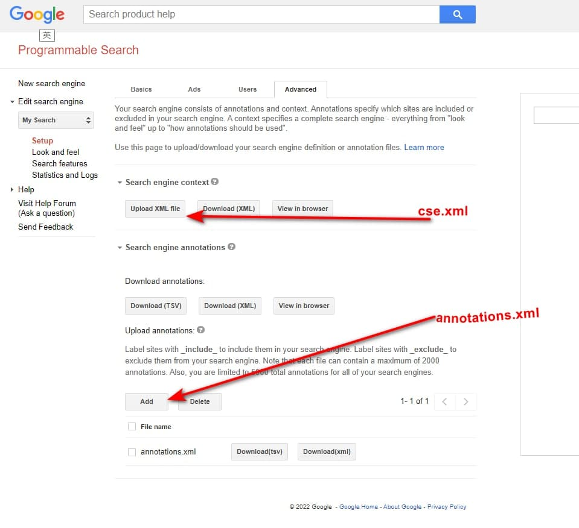
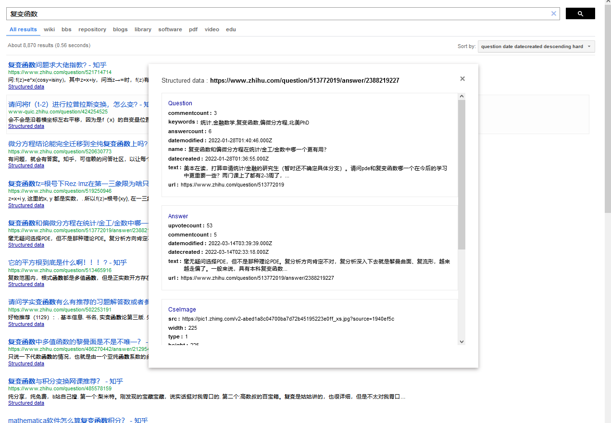
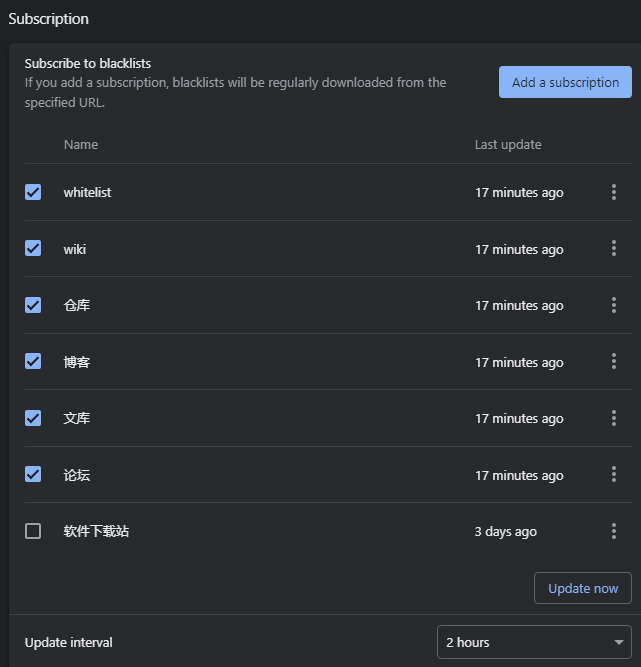

# Computer-Science-Whitelist

## Table of contents
- <a href="#introduction">Introduction</a>
- <a href="#google-programmable-search-engine">programmablesearchengine.google.com</a>
    - <a href="#sort">Sort</a>
    - <a href="#sort-by-key">Sort by key</a>
    - <a href="#configuration">Configuration</a>
    - <a href="#html">Static web pages</a>
    - <a href="#TinyGoogle">Search content by Google Custom Search API</a>
- <a href="#ublacklist">uBlacklist</a>
    - <a href="#introduction-of-ublacklist">introduction of uBlacklist</a>
    - <a href="#whitelist-mode">whitelist mode</a>
    - <a href="#subscription-rules">subscription rules</a>
- <a href="#other-ways-of-using-it">other ways of using it</a>
- <a href="#reference">reference</a>


## introduction

垃圾站点越来越多，而黑名单是无限的，白名单可以是有限的，以有限的精力去维护有限的白名单，于是这个白名单就这么出来了。

这个名单只收集<b>问答论坛</b>，和类似 wiki 的高质量内容网站。

名单整理，用数据库(sqlite3)比较方便，从数据库中读取所有的表。合并成一个字典。然后使用这个字典生成 txt, xml 到 whitelists/.

```sql
# 表结构：

CREATE TABLE "table_name_1" ( "domain" TEXT NOT NULL,
  "prefix" TEXT NOT NULL DEFAULT '',
  "suffix" TEXT NOT NULL DEFAULT '',
  "score" integer NOT NULL DEFAULT 0.3,
  "description" TEXT NOT NULL DEFAULT '',
  PRIMARY KEY ("domain")
);

# 最外面的字典看作是数据库，其中每一个键值对就是一张表
whitelist_dics{ 
    table_name_1:{
        domain_name_1: [prefix, suffix, score, description],
        domain_name_2: [prefix, suffix, score, description],
    },
    table_name_2:{
        domain_name_1: [prefix, suffix, score, description],
        domain_name_2: [prefix, suffix, score, description],
    },
}
```

目录结构:

```
.
├── html
│   ├── cse_google_nginx_conf
│   └── index.html
├── main.py
├── README.md
├── whitelists
│   ├── annotations.xml
│   ├── bbs.txt
│   ├── blogs.txt
│   ├── cse.xml
│   ├── cse_FacetLabels.xml
│   ├── domain_name.txt
│   ├── library.txt
│   ├── repository.txt
│   ├── software.txt
│   ├── video.txt
│   ├── whitelist.txt
│   ├── whitelists_combined.txt
│   └── wiki.txt
└── whitelists.db

2 directories, 18 files
```

使用与调试：

先用自定义搜索，如果添加了知识实体，那结果将会被严格限制，如，添加 `Computer Science`，在搜索 "辱骂" 一词时给出的也多为 "辱骂检测技术"，不会显示社会热点。

如果没有想要的结果，再点击页面最下方的 `Search for [关键词] on Google`，使用 uBlacklist 的白名单对 Google 的搜索结果进行过滤，如果还没有想要的结果，点击 Show 显示被过滤的网站，找到比较不错的网站，再添加到白名单中。

## google programmable search engine

配置: <a href="./whitelists/cse.xml">./whitelists/cse.xml</a> 

名单: <a href="./whitelists/annotations.xml">./whitelists/annotations.xml</a>

在高级选项中上传:



cse.xml 可设项有些多，在网页上修改比较简单。

测试链接：<a href="https://cse.google.com/cse?cx=e9a1e480e37a86080&q=">https://cse.google.com/cse?cx=e9a1e480e37a86080</a>

使用的知识实体为：`Stack Exchange`, `Mathematics`, `Computer Science`, `network`, `Software development`。

搜索关键词，在链接最后加上 `&q=`, 如  https://cse.google.com/cse?cx=e9a1e480e37a86080&q=

### sort

根据分数或权重排序：

只给 Annotation 添加 score 属性就可以对其排序，value from -1.0 to 1.0

可以在 socre 的基础上给 Label 标签排序，使用 weight 字段，value from -1.0 to 1.0
 
weight > score

<b>一级排序：</b>

为不同的 Label 排序，在 cse.xml 中添加标签(Label)并设置权重(weight, from -1.0 to 1.0)

示例：

```xml
<CustomSearchEngine>
  <Title>My Search</Title>
  <Context>
    <Facet>
      <FacetItem>
        <Label name="wiki" mode="FILTER" weight="1" enable_for_facet_search="true">
          <Rewrite/>
          <entities/>
        </Label>
        <Title>wiki</Title>
      </FacetItem>
      <FacetItem>
        <Label name="bbs" mode="FILTER" weight="0.8" enable_for_facet_search="true">
          <Rewrite/>
          <entities/>
        </Label>
        <Title>bbs</Title>
      </FacetItem>
    </Facet>
    <BackgroundLabels>
      <Label name="_include_" mode="FILTER"/>
      <Label name="_exclude_" mode="ELIMINATE"/>
    </BackgroundLabels>
  </Context>
...
```

上述文件中有两个 Label 分别是 wiki, bbs，其权重分别为 1.0, 0.8

这两个标签下的所有 Annotation 都以这个为排序，每个 Annotation 可以多个 Label。

当 Rewrite 中有内容且没有任何网址拥有这些标签时，对应的 Label 的 mode 只能选 BOOST，不然搜索结果中，该标签下不会有结果

<b>二级排序(标签内部微调):</b>

在 annotations.xml 中为每一个 Annotation 的 Label 添加 score 属性，值同样是 from -1.0 to 1.0

示例：

```xml
<?xml version="1.0" encoding="UTF-8"?>
<Annotations start="0" num="84" total="84">
  <Annotation about="*.uptodown.com/*" score="0.8" timestamp="0x0005d6b5044e8329" href="ChAqLnVwdG9kb3duLmNvbS8qEKmGuqLQ1vUC">
    <Label name="_include_"/>
    <Label name="software"/>
  </Annotation>
  <Annotation about="*.wenku.baidu.com/view*" score="0.7" timestamp="0x0005d6b5044e82a2" href="ChcqLndlbmt1LmJhaWR1LmNvbS92aWV3KhCihbqi0Nb1Ag">
    <Label name="_include_"/>
    <Label name="library"/>
  </Annotation>
  <Annotation about="*.edu/*" score="0.3" timestamp="0x0005d6b5044e829f" href="CgcqLmVkdS8qEJ-FuqLQ1vUC">
    <Label name="_include_"/>
    <Label name="blogs"/>
  </Annotation>
  <Annotation about="*.liaoxuefeng.com/wiki*" score="0.5" timestamp="0x0005d6b5044e8292" href="ChcqLmxpYW94dWVmZW5nLmNvbS93aWtpKhCShbqi0Nb1Ag">
    <Label name="_include_"/>
    <Label name="blogs"/>
  </Annotation>
</Annotations>
```

当 score <= 0 时，该地址可能不会出现在结果中，所以最小也应该设置为 0.01


### sort by key

用于搜索结果的右侧下拉框。

Search features -> Advanced -> Results sorting

当点击 Add key 按钮时，在弹出的窗口中填入两个字段，Key 和 Label。其中 Key 是排序的代码，带有星号的 Label 是显示出的提示文字。

|key|label  | description |
|:-:|:-:    | :-|
|date       | Date               | date descending 以日期降序排序，默认就有的 key |
|           |relevance| 以相关性排序，key 是 relevance，但必须留空，默认就有的 key |
|`date-sdate:a` | date ascending | date 是排序方式，sdate 是网页中实际使用的用来描述 date 的变量名，`:a` ascending 升序，默认是 hard sort |
|`date:a:w` |date ascending weak | 以日期软升序排序 ascending weak |
|`date:a`   |date ascending hard | 强制以日期升序排序 ascending (hard default) |
|`question-answercount:d:w`  | question answercount descending weak | 问题回答数量 descending weak |
|`question-datecreated:d`    | question datecreated descending hard | 问题创建日期 descending (hard default) |
|`answer-upvotecount:d`      | answer upvotecount descending hard   | 回答赞同数量 descending (hard default)，每个回答都有点赞数和踩数，不知道具体用哪一个 |

问题-回答数（弱降序），问题-赞同数(强降序) 适用于知乎, Stack Exchange 等问答论坛。

<b>使用 structured data 字段排序</b>

显示搜索结果的结构化数据: Search features -> Advanced -> Websearch Settings -> Structured Data in Results -> Enable

如下图：



如果要使用 Answer -> commentcount 来排序。

对应的 Key 是 `answer-commentcount:d` 或 `answer-commentcount:d:w`, `answer-commentcount:a`, `answer-commentcount:a:w`

d 是 decending， a 是 ascending ，默认是 hard sort，可能损失相关性，后跟 `:w` 表示 weak sort

<a href="https://developers.google.com/custom-search/docs/structured_search">其他的一些可选 key</a> 

### configuration

annotations.xml 文件说明：https://developers.google.com/custom-search/docs/annotations

annotations.xml 层级结构：

```
Annotations (root element)
    Annotation
        Label
        Comment (optional)

```

cse.xml 中的 CustomSearchEngine 的属性，只有 language, encoding, enable_promotions, autocompletions 是需要根据个人需要进行修改。

其他的字段，如 id, creator, cx_id 是固定的，不需要写在文件中，即使上传的 cse.xml 中没有这些，系统会自动生成。还有 last_update_time_millis 字段，也是系统自动生成的，不需要手动添加。

annotations.xml 中的 Annotations 的属性 start, num, total, 也是会自动生成，手动加上方便查看。timestamp, href, 是系统生成的，不需要手动添加。

<b>如果一个 url 不是通过上传 annotations.xml 所添加，那么在高级选项下删除 annotations.xml 也不会将这个 url 移除</b>

### html

（1）修改样式，默认样式太窄了

（2）过滤广告

（3）一些其他的设置

<b>ad filtering</b>

```css
.gsc-adBlock {display:none !important}
```

<b>focus on input box</b>

```html
<!DOCTYPE html>
<html lang="en">
<head>
  <meta charset="UTF-8">
  <title>Custom Search Engine</title>
  <script type="text/javascript">
    function focusFieldOne() {
      document.querySelector('input[name="search"]').focus()
    }
  </script>
  <style>
    /*  Google Adsense  */
    .gsc-adBlock {display:none !important}
  </style>
</head>
<body onload="focusFieldOne()">
  <script async src="https://cse.google.com/cse.js?cx=[Your search ID]"></script>
  <div class="gcse-search"></div>
</body>
</html>
```

app.netlify.com 可以部署 github 上的静态网页，效果：https://computer-science-whitelist.netlify.app

### TinyGoogle

https://github.com/bcaso/TinyGoogle

Features：

* Search content by Google Custom Search API
* No annoying google captcha


问题：没有标签页分类


## ublacklist

### introduction of ublacklist

PC 浏览器(Chrome, Firefox, Edge, Safair(支持移动端))插件。

<a href="https://github.com/iorate/uBlacklist" target="_blank">uBlacklist</a> 目前支持搜索引擎有 Google, Bing, DuckDuckgo, Ecosia, Startpage, Qwant

* 访问速度: Bing 最快。

* 样式: Bing 最好。
  * 在使用油猴本 <a href="https://www.ntaow.com/aboutscript.html" target="_blank">AC-重定向</a> 将搜索结果多列显示时，Bing 的样式要比 Google 整齐。
  * Bing 页面最底端没有搜索关键词对应的相关图片。

* 拦截能力: 对 Google 的拦截效果最好。
  * Bing 下，常出现 3~5 个不在名单中的网站，以及视频卡片，新闻卡片，相关搜索，可通过油猴插件写脚本进行过滤。


### whitelist mode

插件本是针对垃圾网站进行过滤，也就是黑名单模式，修改下使用方式就能实现白名单过滤。

黑名单规则总是优于白名单生效。

所以可以先添加规则 `*://*/*` 以屏蔽所有网址。

添加：`@:*//前缀.域名.后缀`(如 `@:*//*.github.com/*`, 区分大小写) 取消对某个网站的过滤。

规则举例：
```python
# 有前缀
@:*//*.github.com/*

# 没前缀
@:*//github.com/*

# 不完整的后缀
@*://*.docin.com/p-*
@*://*.doc88.com/p-*
@*://*.taodocs.com/p-*

# 完整的后缀
@*://*.appinn.com/*
```

通过前后缀区分一个地址的类型。

<b>使用"最长前缀匹配规则", 过滤奇怪的结果，或者不相关结果。</b>

规则是从左往右匹配的。

如，脚本之家：

```
https://www.jb51.net/                             电脑端
https://m.jb51.net/                               移动端
https://www.jb51.net/list/index_96.htm          脚本专栏
https://www.jb51.net/os/win11/808733.html     某个教程页
https://www.jb51.net/softs/794768.html    某个软件下载页
```

只索引它的软件下载页, 规则：`@*://*.jb51.net/softs*`，就能过滤掉其他页面。

后缀匹配的规则，如 `@*://*.edu/*`。

修改搜索设置，将搜索结果数调得尽可能大，白名单模式会使得每一搜索页中的内容变得特别少, 因为符合白名单的网站，可能不在结果的第一页。

自动翻页插件: <a href="https://chrome.google.com/webstore/detail/uautopagerize/kdplapeciagkkjoignnkfpbfkebcfbpb" target="_blank">uAutoPagerize</a>, 以及油猴脚本 <a href="https://greasyfork.org/en/scripts/438684-pagetual">东方永动机</a> 可以在自动翻页的同时过滤搜索结果。


### subscription rules

为保证白名单生效，先订阅 whitelist.txt

<b>点击添加订阅</b>：<a href="https://iorate.github.io/ublacklist/subscribe?name=whitelist&url=https://raw.githubusercontent.com/bcaso/Google-Chinese-Results-Whitelist/main/whitelists/whitelist.txt">whitelist</a>

再分类订阅:

1. <a href="https://iorate.github.io/ublacklist/subscribe?name=wiki&url=https://raw.githubusercontent.com/bcaso/Computer-Science-Whitelist/main/whitelists/wiki.txt">wiki</a>
2. <a href="https://iorate.github.io/ublacklist/subscribe?name=仓库&url=https://raw.githubusercontent.com/bcaso/Computer-Science-Whitelist/main/whitelists/repository.txt">仓库</a>
3. <a href="https://iorate.github.io/ublacklist/subscribe?name=博客&url=https://raw.githubusercontent.com/bcaso/Computer-Science-Whitelist/main/whitelists/blogs.txt">博客</a>
4. <a href="https://iorate.github.io/ublacklist/subscribe?name=论坛&url=https://raw.githubusercontent.com/bcaso/Computer-Science-Whitelist/main/whitelists/bbs.txt">论坛</a>
5. <a href="https://iorate.github.io/ublacklist/subscribe?name=软件下载站&url=https://raw.githubusercontent.com/bcaso/Computer-Science-Whitelist/main/whitelists/software.txt">软件下载站</a>
6. <a href="https://iorate.github.io/ublacklist/subscribe?name=文库&url=https://raw.githubusercontent.com/bcaso/Computer-Science-Whitelist/main/whitelists/library.txt">文库</a>
7. <a href="https://iorate.github.io/ublacklist/subscribe?name=视频&url=https://raw.githubusercontent.com/bcaso/Computer-Science-Whitelist/main/whitelists/video.txt">视频</a>

或者不分类，直接订阅总列表: <a href="https://iorate.github.io/ublacklist/subscribe?name=whitelists_combined&url=https://raw.githubusercontent.com/bcaso/Computer-Science-Whitelist/main/whitelists/whitelists_combined.txt">汇总列表</a>

以上链接会自动打开 chrome 上的 uBlacklist 插件，同时添加订阅。

分类订阅比订阅总列表的可控度高，根据内容需要，可在搜索前只启用一部分：




## other ways of using it

域名列表: <a href="./whitelists/domain_name.txt">./whitelists/domain_name.txt</a> ，在油猴脚本中改下判断规则代码就可以使用。

这个文件中的名单规则也是 cse.google.com 的规则，可以批量添加，只有列表，没有分数排序，没有标签页分类，删除时最多只能一次删除10个。

在 cse.google.com 的 Setup 下，复制该文件中的所有内容，粘贴到 Sites to search -> Add -> Include sites in bulk 的文本编辑框中。选择 Include just the specific pages I have entered. 然后点击保存。

可以在导入名单后，在高级选项中导出 annotations.xml。然后慢慢清空所有的列表，再上传 annotations.xml。列表管理用 annotations.xml 更方便，<b>如果一个 url 不是通过上传 annotations.xml 所添加(手动添加)，那么在高级选项下删除 annotations.xml 也不会将这个 url 移除</b>，只能一点点的删除。

可以上传多个 annotations.xml，所以可以通过文件分类。

<hr>
# reference

[Google I/O 2009 - Advanced Custom Search Configuration https://www.youtube.com/watch?v=fIUHTFvIt9c ](https://www.youtube.com/watch?v=fIUHTFvIt9c)

[google cse documentation https://developers.google.com/custom-search/docs/overview ](https://developers.google.com/custom-search/docs/overview)

[Gaga for Google Custom Search Engines https://www.youtube.com/watch?v=uX5nbIHRTAo ](https://www.youtube.com/watch?v=uX5nbIHRTAo)

[Google Custom Search Engines | Sourcing https://www.youtube.com/watch?v=t1szVhH5dIo ](https://www.youtube.com/watch?v=t1szVhH5dIo)

<a href="https://github.com/cobaltdisco/Google-Chinese-Results-Blocklist" target="_blank">uBlacklist 黑名单规则 github.com/cobaltdisco/Google-Chinese-Results-Blocklist</a>
