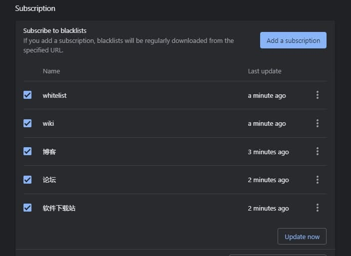

# Google-Chinese-Results-Whitelist

垃圾站点出现在 Google 中文搜索结果中，实在是恶心——于是这个白名单就这么出来了。

这个名单专注收集<b>问答论坛</b>，和具有 wiki 性质的高质量内容网站，类型偏向电脑技术。 

## 搜索引擎

只要是支持自定义过滤搜索结果的搜索引擎，都是不错的选择。

<a href="https://github.com/iorate/uBlacklist" target="_blank">uBlacklist</a> 目前支持搜索引擎有 Google, Bing, DuckDuckgo, Ecosia, Startpage

* 就访问速度上看，Bing 最快。

* 就样式上看，Bing 最好
  * 在使用油猴本 <a href="https://www.ntaow.com/aboutscript.html" target="_blank">AC-重定向</a> 将搜索结果多列显示时，Bing 的样式要比 Google 好看，Google 显得有些乱。
  * Bing 页面最底端没有相关搜索(几乎用不到，还占位置)，也没有搜索关键词对应的相关图片。

* 就拦截能力上看，目前 (V7.0 版)，对于 Google 的拦截效果最好。
  * Bing 下，常出现 3~5 个不在名单中的网站，以及视频卡片，新闻卡片，相关搜索，可通过油猴插件写脚本进行过滤。


## 原理：

先添加规则 `*://*/*` 以屏蔽所有网址。

对于白名单，这样添加： `@:*//前缀.域名.后缀`，如 `@:*//*.github.com/*`, 区分大小写

规则举例：
```
# 有前缀
@:*//*.github.com/*

# 没前缀
@:*//github.com/*

# 不完整的后缀
@*://*.docin.com/p-*
@*://*.doc88.com/p-*
@*://*.taodocs.com/p-*

# 完整的后缀
@*://*.appinn.com/*
```

对网站进行分类，然后统一生成符合 uBlacklist 规则的白名单。

另外可通过前后缀区分一个地址的类型。

建议使用"最长前缀匹配规则"：

规则是从左往右匹配的。

如，脚本之家：

```
手机脚本之家 https://m.jb51.net/
电脑版脚之家 https://m.jb51.net/
脚本之家脚本专栏 ：https://www.jb51.net/list/index_96.htm
脚本之家的某个教程页：https://www.jb51.net/os/win11/808733.html
脚本之家的某个软件下载页：https://www.jb51.net/softs/794768.html
```

脚本之家的教程或他页面质量不好，但是它的软件下载页偶尔会用到，这时加上规则：`@*://*.jb51.net/softs*`，就能过滤掉除软件下载页的其他页面。

同时支持后缀匹配的规则，如 `@*://*.edu/*`。

如果网站变动地址怎么办？

一般不会经常变动，我整理的这些网址多为论坛，软件下载，他们的这些网址一定会有很多人在引用，不会轻意变动。

最后生成的名单可以汇总到 `whitelists_combined.txt` 中。

<a href="https://github.com/iorate/ublacklist/releases/tag/v7.0.0" target="_blank">uBlacklist 7.0</a> 支持对订阅规则的开关功能，所以可以定阅不同类别的白名单，然后根据搜索需要只开启一部分。

> 注：白名单会使得每一搜索页中的内容变得特别少，因为符合白名单的网站，可能不在结果的第一页，
> 因此，要在设置中，把每页搜索结果数调得尽可能大。
>
> 浏览器插件 <a href="https://chrome.google.com/webstore/detail/uautopagerize/kdplapeciagkkjoignnkfpbfkebcfbpb" target="_blank">uAutoPagerize</a> 支持在自动翻页的同时过滤搜索结果。

目录结构:

```
│   .gitignore
│   main.py
│   README.md
│   subscription.jpg
│
├───whitelists
│       annotations.xml
│       cse.xml
│       domain_name.txt
│       whitelist.txt
│       whitelists_combined.txt
│       wiki.txt
│       仓库.txt
│       博客.txt
│       文库.txt
│       论坛.txt
│       软件下载站.txt
│
\───whitelist_dics
        bbs.py
        blogs.py
        library.py
        repository.py
        software_download.py
        wiki.py
        __init__.py
```
    annotations.xml
    cse.xml
    domain_name.txt
    whitelist.txt
    whitelists_combined.txt
    wiki.txt


## 使用

### uBlacklist

为保证白名单生效，先订阅 whitelist.txt

点击添加订阅：<a href="https://iorate.github.io/ublacklist/subscribe?name=whitelist&url=https://raw.githubusercontent.com/bcaso/Google-Chinese-Results-Whitelist/main/whitelists/whitelist.txt">whitelist</a>

再分类订阅，点击添加订阅：

1. <a href="https://iorate.github.io/ublacklist/subscribe?name=wiki&url=https://raw.githubusercontent.com/bcaso/Google-Chinese-Results-Whitelist/main/whitelists/wiki.txt">wiki</a>
2. <a href="https://iorate.github.io/ublacklist/subscribe?name=仓库&url=https://raw.githubusercontent.com/bcaso/Google-Chinese-Results-Whitelist/main/whitelists/%E4%BB%93%E5%BA%93.txt">仓库</a>
3. <a href="https://iorate.github.io/ublacklist/subscribe?name=博客&url=https://raw.githubusercontent.com/bcaso/Google-Chinese-Results-Whitelist/main/whitelists/%E5%8D%9A%E5%AE%A2.txt">博客</a>
4. <a href="https://iorate.github.io/ublacklist/subscribe?name=论坛&url=https://raw.githubusercontent.com/bcaso/Google-Chinese-Results-Whitelist/main/whitelists/%E8%AE%BA%E5%9D%9B.txt">论坛</a>
5. <a href="https://iorate.github.io/ublacklist/subscribe?name=软件下载站&url=https://raw.githubusercontent.com/bcaso/Google-Chinese-Results-Whitelist/main/whitelists/%E8%BD%AF%E4%BB%B6%E4%B8%8B%E8%BD%BD%E7%AB%99.txt">软件下载站</a>
6. <a href="https://iorate.github.io/ublacklist/subscribe?name=文库&url=https://raw.githubusercontent.com/bcaso/Google-Chinese-Results-Whitelist/main/whitelists/%E6%96%87%E5%BA%93.txt">文库</a>

或者不分类，直接订阅汇总列表

点击添加订阅 <a href="https://iorate.github.io/ublacklist/subscribe?name=whitelists_combined&url=https://raw.githubusercontent.com/bcaso/Google-Chinese-Results-Whitelist/main/whitelists_combined.txt">汇总列表</a>

我感觉分类订阅比订阅总列表的可控度高，根据需要，可在搜索前只启用一部分。



### cse.google.com

<a href="./whitelists/cse.xml">./whitelists/cse.xml</a> 是配置项。

<a href="./whitelists/annotations.xml">./whitelists/annotations.xml</a> 是名单列表。

可以在高级选项中上传。

测试：<a href="https://cse.google.com/cse?cx=e9a1e480e37a86080&q=">https://cse.google.com/cse?cx=e9a1e480e37a86080&q=</a>

### 其他使用方式

<a href="./whitelists/domain_name.txt">./whitelists/domain_name.txt</a> 是域名列表，可以用在油猴脚本中，或许要改下代码来读取。


## 白名单与黑名单

黑名单是无限的。白名单可以是有限的，以有限的精力去维护有限的白名单。

两个 google 帐号，开两个 chrome, 一个用<a href="https://github.com/cobaltdisco/Google-Chinese-Results-Blocklist" target="_blank">黑名单</a>一个用白名单。

经过一段时间的积累，就可以转到白名单。
